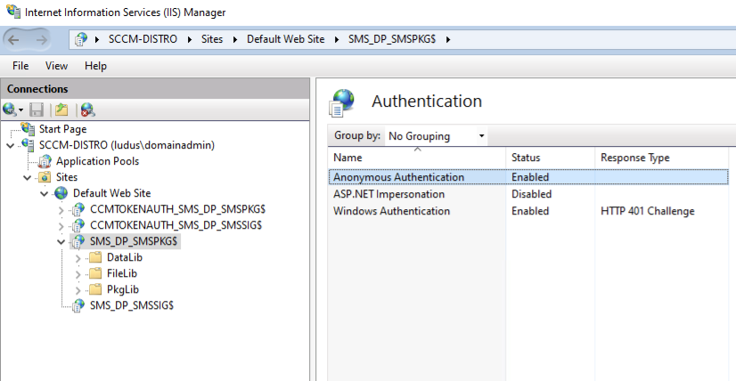
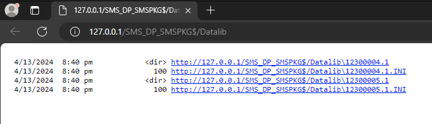
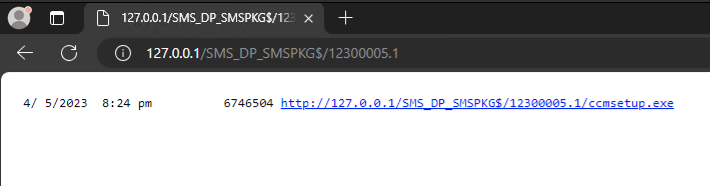
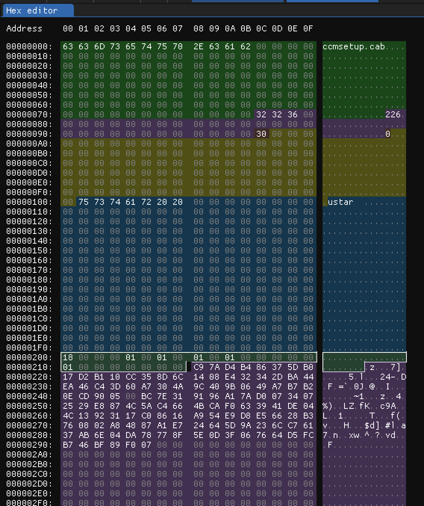

# SCCM HTTP Looter

## How it works

SCCM distribution points (DPs) are the servers used by Microsoft SCCM to host all the files used in software installs, patches, script deployments, etc.
By default, these servers allow access via SMB (TCP/445) and HTTP/S (TCP/80 and/or TCP/443) and require some type of Windows authentication (i.e. NTLM).

The current SCCM DP looting tools rely on the ability to browse SMB shares to collect files. 

- [CMloot](https://github.com/1njected/CMLoot)
- [cmloot](https://github.com/shelltrail/cmloot)

However, it is not uncommon for an organization to limit inbound SMB access to servers on internal networks, and standard practice to prevent inbound SMB access from the internet. HTTP/S access on the other hand is usually not restricted on internal networks, and often allowed from the internet. This presents an opportunity for an attacker if there is a way to get files from the SCCM DP via HTTP/S.

### Why hasn't anyone done this before?

The SMB tools work by enumerating the `DataLib` folder of the `SCCMContentLib$` share to find `<filename.ext>.INI` files which contain the hash of the file. They can then locate the actual file at `FileLib/<hash[0:4]>/<hash>`. This works because with access to the share, you can enumerate all files in the `DataLib` folder.

Using HTTP/S, things are different. Browsing to `http://<SCCM DP>/SMS_DP_SMSPKG$/Datalib` shows a directory listing of numbered files and INIs. 

For a variety of reasons (like [speed](https://old.reddit.com/r/SCCM/comments/5c4niq/sccm_2012_osd_download_faster_with_anonymous/)), these distribution points can be configured to allow anonymous access. 

However, navigating to the non-INI links simply shows the same page, which limits the number of files directly accessible to those in the "root" directory of the Datalib as the hashes extracted from the INI files for directories cannot be used to find the directories in the FileLib since it only stores actual files.

However, browsing to the directory name directly off the `http://<SCCM DP>/SMS_DP_SMSPKG$/` root will show files in that directory, which can be directly downloaded.

This is how the `sccm-http-looter` works normally. It parses the Datalib directory listing for directories, then requests those and parses each for any files, before downloading any files with extensions that are in the allow list specified by the user.

In the case where anonymous access is enabled but directory listing for directories off the `http://<SCCM DP>/SMS_DP_SMSPKG$/` root are disabled, there is a second technique to retrieve files that can be used by running the tool with `-use-signature-method`. In this mode the tool does the following:

1. Downloads the Datalib listing from `http://<SCCM DP>/SMS_DP_SMSPKG$/Datalib`
2. Parses the Datalib for all links
3. Downloads any non .INI link filenames from `http://<SCCM DP>/SMS_DP_SMSSIG$/<filename>.tar`, where `<filename>` is the final element in any href from the Datalib page (i.e. `12300005.1`)
4. Extracts the actual file name from the .tar signature file
5. Downloads the INI file from `http://<SCCM DP>/SMS_DP_SMSPKG$/Datalib/<filename>/<extracted filename>.INI`
6. Extracts the hash from the INI file
7. Downloads the actual file from `http://<SCCM DP>/SMS_DP_SMSPKG$/Filelib/<hash[0:4]>/<hash>` renaming it to the correct file name as specified in the signature file.

The signature files are `.tar` files but are not actual tars. They contain filenames 512 bytes before the byte string `0x18, 0x00, 0x00, 0x00, 0x01, 0x00, 0x01, 0x00, 0x01, 0x00, 0x01` as shown below.

The tool searches for this byte string and extracts all file names from the signature files.
